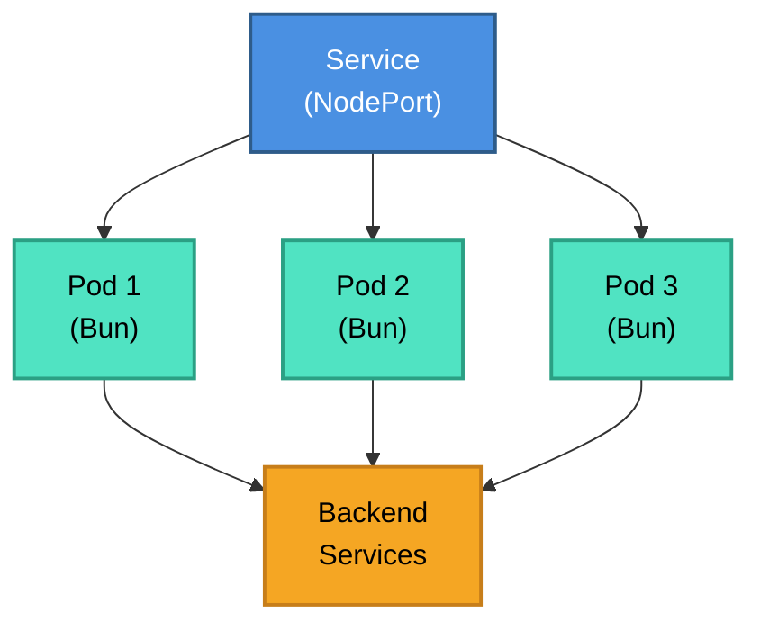

# Proxy-It

High-performance HTTP proxy service for Kubernetes, built with Bun.

## Features

- **Ultra-fast**: Built with Bun for maximum performance
- **Kubernetes-ready**: Complete Helm chart for easy deployment on Rancher
- **Request logging**: JSON-formatted logs for all incoming/outgoing requests
- **Transparent proxy**: Forward requests without modifying headers
- **Auto-deployment**: GitHub Actions for automated Docker image builds
- **Secure**: Security context and resource limits configured

## Quick Start

### Local Development

```bash
# Install dependencies
bun install

# Run in development mode
bun run dev

# Run in production mode
bun start
```

### Docker Build

```bash
# Build the Docker image
docker build -t proxy-it:latest .

# Run the container
docker run -p 3000:3000 proxy-it:latest
```

## GitHub Container Registry (GHCR)

This project uses GitHub Actions to automatically build and publish Docker images to GitHub Container Registry.

### Automatic Builds

Images are automatically built and published when:

- **Push to main**: Creates image tagged with branch name and commit SHA
- **Create tag**: Creates image tagged with semantic version (e.g., `v1.0.0`)

### Available Tags

```bash
# Latest (recommended for development)
ghcr.io/djalmajr/proxy-it:latest

# Branch name
ghcr.io/djalmajr/proxy-it:main

# Specific version (recommended for production)
ghcr.io/djalmajr/proxy-it:v1.0.0
ghcr.io/djalmajr/proxy-it:1.0.0
ghcr.io/djalmajr/proxy-it:1.0
ghcr.io/djalmajr/proxy-it:1

# Commit SHA (for debugging)
ghcr.io/djalmajr/proxy-it:sha-abc1234
```

### Pull Image

```bash
# Public images (no authentication needed)
docker pull ghcr.io/djalmajr/proxy-it:latest

# Run from GHCR
docker run -p 3000:3000 ghcr.io/djalmajr/proxy-it:latest
```

## Kubernetes Installation

### Prerequisites

- Kubernetes cluster (Rancher recommended)
- Helm 3.x installed
- kubectl configured

### Installation with Helm

1. **Update values.yaml**:

Edit `helm/proxy-it/values.yaml` to use your image:

```yaml
image:
  repository: ghcr.io/djalmajr/proxy-it
  tag: "v1.0.0"
  pullPolicy: Always

service:
  type: NodePort
  port: 80
```

2. **Install the Helm chart**:

```bash
# Install with chart name
helm install ./helm/proxy-it --generate-name

# Install with custom values
helm install ./helm/proxy-it -f custom-values.yaml --generate-name

# Install in specific namespace
helm install ./helm/proxy-it -n proxy --create-namespace --generate-name
```

3. **Verify installation**:

```bash
# Check pods
kubectl get pods -l app=proxy-it

# Check service (NodePort)
kubectl get svc proxy-it

# Get NodePort access
kubectl get svc proxy-it -o jsonpath='{.spec.ports[0].nodePort}'
```

### Rancher Deployment

1. Navigate to **Apps & Marketplace** → **Charts**
2. Click **Import Helm Chart**
3. Upload the `helm/proxy-it` directory
4. Configure values in the UI
5. Click **Install**

## Usage

### Proxy Requests

All requests are automatically forwarded to the configured target service:

```bash
curl http://localhost:3000/users
# Proxied to: {TARGET_SERVICE}/users

curl http://localhost:3000/api/data?id=123
# Proxied to: {TARGET_SERVICE}/api/data?id=123
```

### Health Check

```bash
curl http://localhost:3000/health
```

Response:

```json
{
  "status": "healthy",
  "uptime": 1234.56,
  "timestamp": "2025-01-01T00:00:00.000Z"
}
```

### Request Logging

All requests are logged in JSON format to stdout:

**Incoming request log**:

```json
{
  "timestamp": "2025-01-01T00:00:00.000Z",
  "method": "GET",
  "origin": "http://localhost:3000",
  "path": "/users",
  "query": "?page=1",
  "targetUrl": "http://backend-service:8080/users?page=1",
  "headers": { "user-agent": "curl/7.68.0", "accept": "*/*", ... }
}
```

**Response log**:

```json
{
  "timestamp": "2025-01-01T00:00:00.123Z",
  "method": "GET",
  "targetUrl": "http://backend-service:8080/users?page=1",
  "status": 200,
  "statusText": "OK",
  "duration": "123ms"
}
```

**Error log**:

```json
{
  "timestamp": "2025-01-01T00:00:00.456Z",
  "method": "GET",
  "targetUrl": "http://backend-service:8080/users",
  "error": "Connection refused",
  "duration": "45ms"
}
```

## Configuration

### Environment Variables

| Variable         | Default        | Description                                          |
| ---------------- | -------------- | ---------------------------------------------------- |
| `PORT`           | `3000`         | Server port                                          |
| `NODE_ENV`       | `production`   | Node environment                                     |
| `TARGET_SERVICE` | **(required)** | Target service URL (e.g., `http://backend-api:8080`) |

### Helm Values

Key configuration options in `values.yaml`:

```yaml
# Replicas
replicaCount: 1

# Image (from GitHub Container Registry - public)
image:
  tag: latest # or specific version like v1.0.0
  repository: ghcr.io/djalmajr/proxy-it

# Service (NodePort for direct access)
service:
  type: NodePort
  port: 80

# Target service for proxy (required)
proxy:
  targetService: "" # e.g., http://backend-api:8080

# Notes:
# - Environment variables (PORT=3000, NODE_ENV=production) are set via ConfigMap
# - imagePullPolicy: Always is hardcoded to ensure latest images
```

## Helm Commands

```bash
# List installed releases
helm list

# Upgrade deployment
helm upgrade proxy-it ./helm/proxy-it

# Upgrade with new values
helm upgrade proxy-it ./helm/proxy-it -f custom-values.yaml

# Rollback to previous version
helm rollback proxy-it

# Uninstall
helm uninstall proxy-it

# Test templates locally
helm template ./helm/proxy-it

# Lint chart
helm lint ./helm/proxy-it

# Dry run install
helm install ./helm/proxy-it --dry-run --debug --generate-name
```

## Architecture



## CI/CD with GitHub Actions

The project includes a GitHub Actions workflow that automatically:

- Builds Docker images on every push to main
- Publishes images to GitHub Container Registry (GHCR)
- Tags images with semantic versions from git tags
- Caches layers for faster builds
- Supports multi-architecture builds (linux/amd64)

### Workflow Triggers

```yaml
# Automatic builds on:
- Push to main branch
- Git tags (v*.*.*)
```

### Creating a Release

```bash
# Tag a new version
git tag v1.0.0
git push origin v1.0.0

# GitHub Actions will automatically:
# - Build the image
# - Tag as: v1.0.0, 1.0.0, 1.0, 1, main, sha-abc1234
# - Push to ghcr.io/djalmajr/proxy-it
```

## Troubleshooting

### Pod CrashLoopBackOff

```bash
# Check pod logs
kubectl logs -l app=proxy-it

# Describe pod
kubectl describe pod <pod-name>
```

### Using Private Images from GHCR

If you need to use a private image, you'll need to create an image pull secret:

```bash
# Create secret with GitHub token
kubectl create secret docker-registry ghcr-secret \
  --docker-server=ghcr.io \
  --docker-username=djalmajr \
  --docker-password=GITHUB_TOKEN \
  --docker-email=EMAIL

# Update deployment.yaml to use the secret:
# Add pullSecrets field back to values.yaml:
image:
  pullSecrets: ghcr-secret
```

## License

MIT
